# HAARF: Healthcare AI Agents Regulatory Framework

> 🏥 **The world's first comprehensive regulatory compliance framework for autonomous AI agents in healthcare environments**

[]()
[]()
[]()
[](https://creativecommons.org/licenses/by-sa/4.0/)

## 🎯 What is HAARF?

The **Task Force for AI Agents in Healthcare** presents the world's first **unified, lifecycle-centric regulatory framework** specifically designed for autonomous AI agents in medical environments. Our framework synthesizes the most effective elements from global regulatory bodies—FDA, EU AI Act, Health Canada, UK MHRA, NIST, and WHO—into a comprehensive standard that addresses the unique risks and opportunities of agentic AI systems.

**Unlike traditional AI/ML models that provide predictions, AI agents take autonomous actions.** This fundamental difference requires a new regulatory paradigm focused on continuous governance, traceability, and human oversight.

## 🤖 Understanding AI Agents in Healthcare

AI agents are **autonomous, goal-directed systems** that:

### Core Characteristics
- **🔄 Autonomous Decision-Making**: Make independent choices within defined parameters
- **🎯 Goal-Oriented Behavior**: Plan and execute sequences of actions to achieve specific objectives  
- **🔌 Active Integration**: Direct interaction with healthcare systems (EHRs, diagnostic tools, medical devices)
- **📈 Adaptive Learning**: Continuous learning and evolution from real-world clinical data
- **🤝 Human-AI Collaboration**: Augment human capabilities while maintaining human oversight

### Critical Distinction
**Traditional AI**: Input → Prediction → Human Decision  
**AI Agents**: Input → Autonomous Planning → Direct Action → Continuous Learning

```mermaid
graph LR
    subgraph "Traditional AI Pipeline"
        T1["📥 Input Data"] --> T2["🧠 AI Model"]
        T2 --> T3["📊 Prediction/Analysis"]
        T3 --> T4["👨‍⚕️ Human Decision"]
        T4 --> T5["🎯 Action Taken"]
    end
    
    subgraph "AI Agent Pipeline"
        A1["📥 Input Data"] --> A2["🤖 AI Agent"]
        A2 --> A3["📋 Autonomous Planning"]
        A3 --> A4["🎯 Direct Action"]
        A4 --> A5["🔄 Continuous Learning"]
        A5 -.->|"Feedback Loop"| A2
        
        A4 --> A6["👨‍⚕️ Human Oversight"]
        A6 -.->|"Intervention if needed"| A2
    end
    
    style T4 fill:#4caf50,stroke:#2e7d32
    style A4 fill:#ff5722,stroke:#d84315
    style A5 fill:#2196f3,stroke:#1565c0
    style A6 fill:#ff9800,stroke:#f57c00
```



## 🏛️ Eight Core Verification Categories

Based on comprehensive analysis of global regulatory approaches and insights from our Healthcare AI Agents Working Group meetings with FDA industry committee stakeholders, our framework establishes **eight comprehensive verification categories** for AI agent governance in healthcare, with recent FDA priority enhancements addressing tool-enabled agent regulatory pathways:

### 🔐 **C1: Unified Risk & Lifecycle Assessment**
**Enhanced FDA-EU Model with SaMD Classification & 510(k) Pathway**

- **SaMD Risk Mapping**: Four-tier classification system (Class I-IV) based on healthcare decision state and situation severity
- **FDA 510(k) Predicate Analysis**: Comprehensive substantial equivalence determination for clearance pathway
- **Enhanced PCCP**: FDA-style Predetermined Change Control Plans with clinical evidence requirements
- **Clinical Evidence Scaling**: Risk-based evidence requirements from analytical validation to randomized controlled trials
- **Continuous Monitoring**: Real-time surveillance for model drift and performance degradation
- **Regulatory Sandboxes**: UK MHRA-style testing environments for real-world evidence generation

### 📋 **C2: Model Passport & Traceability**
**Complete Lifecycle Documentation & Accountability**

- **Data Lineage**: Full provenance tracking with Health Canada SGBA+ diversity analysis
- **Model Lineage**: Comprehensive documentation of algorithms, training, and updates
- **Decision Lineage**: Explainable AI audit trails for every agent output
- **Machine-Interpretable**: Automated compliance verification and regulatory reporting

### 🛡️ **C3: Proactive Cybersecurity Framework**
**[OWASP AISVS](https://github.com/OWASP/AISVS)-Aligned AI-Specific Threat Protection**

- **AISVS Primary Reference**: Organizations align with [OWASP Artificial Intelligence Security Verification Standard (AISVS)](https://github.com/OWASP/AISVS)
- **Adversarial Robustness**: Mandatory testing against prompt injection and evasion attacks
- **Supply Chain Integrity**: Full vetting of pre-trained models and dependencies
- **Real-Time Threat Monitoring**: Continuous anomaly detection for agent behavior
- **Healthcare-Specific Adaptations**: AISVS requirements adapted for clinical environments

### 👤 **C4: Human Oversight & Integration**
**Clinical Augmentation with Accountability**

- **Clear Accountability**: Defined human responsibility chains throughout agent lifecycle
- **Clinical Oversight**: Human validation required for all critical healthcare decisions
- **Human Factors Engineering**: Mandatory usability testing to prevent automation bias
- **Transparency Requirements**: Agent capabilities and limitations clearly communicated to users

### 🆔 **C5: Agent Registration & Identity**
**Comprehensive Agent Visibility & Control**

- **Healthcare Agent Cataloging**: Centralized registries for all AI agents in clinical environments
- **Identity Verification**: Cryptographic authentication and healthcare IAM integration
- **Lifecycle Management**: Complete tracking from deployment to decommissioning
- **Behavioral Monitoring**: Anomaly detection and security event correlation

### 🎛️ **C6: Autonomy Governance & Control**
**Progressive Autonomy with Safety Boundaries**

- **Autonomy Classification**: Standardized levels from co-pilot to full autonomous operation
- **Progressive Implementation**: Safety gates and clinical validation for autonomy advancement
- **Human-Agent Authority**: Clear decision boundaries and emergency override capabilities
- **Multi-Agent Coordination**: Governance for coordinated autonomous agent systems

### ⚖️ **C7: Bias Mitigation & Population Equity**
**Fairness Across All Patient Populations**

- **Demographic Representativeness**: Comprehensive training data diversity requirements
- **Algorithmic Bias Detection**: Multi-metric fairness assessment and intersectional analysis
- **Vulnerable Population Protection**: Enhanced safeguards for at-risk patient groups
- **Global Health Equity**: Considerations for resource-limited and diverse healthcare settings

### 🔧 **C8: Tool Use & Integration Security** ⭐ *FDA Priority Enhancement*
**Regulatory Compliance for Tool-Enabled Agents**

- **Tool Authorization Controls**: Role-based access with clinical appropriateness validation
- **Medical Device Integration**: FDA-compliant integration without altering device classification
- **Clinical Tool Selection**: Evidence-based tool selection with contraindication checking
- **Cascading Failure Prevention**: Circuit breakers and isolation mechanisms
- **Regulatory Pathway Analysis**: Tool combination impact on FDA submission requirements
- **Quality System Integration**: Manufacturing controls for tool-enabled agent development

## 🎨 Framework Architecture

```mermaid
graph TB
    subgraph "HAARF Framework Overview"
        C1["🔐 C1: Risk & Lifecycle<br/>Assessment"]
        C2["📋 C2: Model Passport &<br/>Traceability"]
        C3["🛡️ C3: Cybersecurity<br/>Framework"]
        C4["👤 C4: Human Oversight &<br/>Integration"]
        C5["🆔 C5: Agent Registration &<br/>Identity"]
        C6["🎛️ C6: Autonomy Governance<br/>& Control"]
        C7["⚖️ C7: Bias Mitigation &<br/>Population Equity"]
        C8["🔧 C8: Tool Use &<br/>Integration Security"]
        
        C1 --> C2
        C1 --> C3
        C3 --> C5
        C4 --> C6
        C2 --> C7
        C5 --> C8
        
        style C8 fill:#ffeb3b,stroke:#f57f17,color:#000
        style C1 fill:#e3f2fd,stroke:#1976d2
        style C3 fill:#f3e5f5,stroke:#7b1fa2
    end
    
    subgraph "Risk Levels"
        L1["Level 1<br/>85 Requirements<br/>Foundational"]
        L2["Level 2<br/>144 Requirements<br/>Standard"]
        L3["Level 3<br/>50 Requirements<br/>Advanced"]
        
        L1 --> L2
        L2 --> L3
    end
    
    C1 -.->|"Risk Classification"| L1
```



## 🌍 Regulatory Framework Mappings

HAARF provides **comprehensive mappings** to major regulatory frameworks:

| Framework | Coverage | Key Benefits |
|-----------|----------|--------------|
| **[FDA Digital Health](https://www.fda.gov/regulatory-information/search-fda-guidance-documents/marketing-submission-recommendations-predetermined-change-control-plan-artificial-intelligence)** | 84% | 510(k) pathway, PCCP templates, breakthrough device guidance |
| **[EU AI Act](https://artificialintelligenceact.eu/)** | 71% | High-risk classification, human oversight, transparency |
| **[Health Canada SGBA+](https://cihr-irsc.gc.ca/e/50968.html)** | 67% | Comprehensive equity analysis, vulnerable populations |
| **[UK MHRA](https://www.gov.uk/government/organisations/medicines-and-healthcare-products-regulatory-agency)** | 60% | AI Airlock integration, real-world evidence |
| **[NIST AI RMF](https://www.nist.gov/itl/ai-risk-management-framework)** | 88% | Complete 4-function mapping (Govern/Map/Measure/Manage) |
| **[OWASP AISVS](https://github.com/OWASP/AISVS)** | 56% | Primary cybersecurity reference with healthcare adaptations |
| **[WHO GI-AI4H](https://www.who.int/initiatives/global-initiative-on-ai-for-health)** | 48% | Global health equity, ethics alignment |
| **[ISO/IEC 42001](https://www.iso.org/standard/42001)** | 71% | AI management system certification |
| **[IMDRF GMLP](https://www.imdrf.org/documents/good-machine-learning-practice-medical-device-development-guiding-principles)** | 72% | International harmonization foundation |

**Multi-Jurisdictional Value**: Single HAARF compliance supports regulatory submissions across multiple jurisdictions, reducing regulatory burden and enabling global deployment.

```mermaid
graph TD
    subgraph "HAARF Framework"
        H["🏥 HAARF<br/>Healthcare AI Agents<br/>Regulatory Framework"]
    end
    
    subgraph "Regulatory Mappings"
        FDA["🇺🇸 FDA Digital Health<br/>84% Coverage<br/>510(k) Pathway"]
        EU["🇪🇺 EU AI Act<br/>71% Coverage<br/>High-Risk Classification"]
        NIST["📊 NIST AI RMF<br/>88% Coverage<br/>4-Function Mapping"]
        HC["🇨🇦 Health Canada<br/>67% Coverage<br/>SGBA+ Analysis"]
        MHRA["🇬🇧 UK MHRA<br/>60% Coverage<br/>AI Airlock"]
        OWASP["🔒 OWASP AISVS<br/>56% Coverage<br/>Security Standards"]
        WHO["🌍 WHO GI-AI4H<br/>48% Coverage<br/>Global Health Equity"]
        ISO["📋 ISO/IEC 42001<br/>71% Coverage<br/>Management System"]
        IMDRF["🔧 IMDRF GMLP<br/>72% Coverage<br/>International Harmonization"]
    end
    
    H --> FDA
    H --> EU
    H --> NIST
    H --> HC
    H --> MHRA
    H --> OWASP
    H --> WHO
    H --> ISO
    H --> IMDRF
    
    style H fill:#2196f3,stroke:#1565c0,color:#fff
    style FDA fill:#4caf50,stroke:#2e7d32,color:#fff
    style NIST fill:#4caf50,stroke:#2e7d32,color:#fff
    style IMDRF fill:#4caf50,stroke:#2e7d32,color:#fff
```



## 📁 Repository Structure

```
├── HAARF/
│   └── 1.0/
│       ├── en/                           # Complete Framework (English)
│       │   ├── 0x10-C01-Risk-Lifecycle-Assessment.md
│       │   ├── 0x10-C02-Model-Passport-Traceability.md
│       │   ├── 0x10-C03-Cybersecurity-Framework.md
│       │   ├── 0x10-C04-Human-Oversight.md
│       │   ├── 0x10-C05-Agent-Registration-Identity.md
│       │   ├── 0x10-C06-Autonomy-Governance.md
│       │   ├── 0x10-C07-Bias-Equity-Population.md
│       │   ├── 0x10-C08-Tool-Use-Integration.md     # FDA Priority ⭐
│       │   ├── 0x90-Appendix-A_Glossary.md
│       │   └── Categories.md
│       ├── mappings/                     # Regulatory Framework Mappings
│       │   ├── fda-mapping.json
│       │   ├── eu-ai-act-mapping.json
│       │   ├── health-canada-mapping.json
│       │   ├── uk-mhra-mapping.json
│       │   ├── nist-ai-rmf-mapping.json
│       │   ├── owasp-aisvs-mapping.json
│       │   ├── who-gi-ai4h-mapping.json
│       │   ├── iso-iec-42001-mapping.json
│       │   ├── imdrf-gmlp-mapping.json
│       │   └── README.md
│       └── tools/                        # Assessment and Validation Tools
```

## 🚀 Getting Started

```mermaid
graph TD
    Start["🚀 Getting Started with HAARF"]
    
    subgraph "User Types"
        HO["🏥 Healthcare Organizations"]
        DEV["💻 AI Developers"]
        REG["📋 Regulatory Affairs"]
    end
    
    Start --> HO
    Start --> DEV
    Start --> REG
    
    subgraph "Healthcare Organization Path"
        HO --> H1["1️⃣ Risk Assessment<br/>(C1 Risk Classification)"]
        H1 --> H2["2️⃣ Security Foundation<br/>(C3 Cybersecurity)"]
        H2 --> H3["3️⃣ Human Oversight<br/>(C4 Clinical Integration)"]
        H3 --> H4["4️⃣ Tool-Enabled Agents<br/>(C8 Tool Use Security)"]
    end
    
    subgraph "AI Developer Path"
        DEV --> D1["1️⃣ Framework Overview<br/>(Categories.md)"]
        D1 --> D2["2️⃣ Implementation Guide<br/>(Using HAARF)"]
        D2 --> D3["3️⃣ Regulatory Mapping<br/>(Jurisdiction Selection)"]
        D3 --> D4["4️⃣ Compliance Verification<br/>(Risk Level Requirements)"]
    end
    
    subgraph "Regulatory Affairs Path"
        REG --> R1["1️⃣ Regulatory Mappings<br/>(Framework Analysis)"]
        R1 --> R2["2️⃣ Submission Guidance<br/>(Evidence Collection)"]
        R2 --> R3["3️⃣ Multi-Jurisdictional Strategy<br/>(Harmonized Approach)"]
        R3 --> R4["4️⃣ FDA Priority Focus<br/>(C8 Tool Use)"]
    end
    
    style HO fill:#4caf50,stroke:#2e7d32,color:#fff
    style DEV fill:#2196f3,stroke:#1565c0,color:#fff
    style REG fill:#ff9800,stroke:#f57c00,color:#fff
    style Start fill:#9c27b0,stroke:#6a1b9a,color:#fff
```



### **For Healthcare Organizations**

1. **Risk Assessment**: Start with [C1 Risk Classification](./HAARF/1.0/en/0x10-C01-Risk-Lifecycle-Assessment.md)
2. **Security Foundation**: Implement [C3 Cybersecurity Framework](./HAARF/1.0/en/0x10-C03-Cybersecurity-Framework.md) 
3. **Human Oversight**: Establish [C4 Clinical Integration](./HAARF/1.0/en/0x10-C04-Human-Oversight.md)
4. **Tool-Enabled Agents**: Apply [C8 Tool Use Security](./HAARF/1.0/en/0x10-C08-Tool-Use-Integration.md) for autonomous systems

### **For AI Developers**

1. **Framework Overview**: Read [Categories.md](./HAARF/1.0/en/Categories.md)
2. **Implementation Guide**: Follow [Using HAARF](./HAARF/1.0/en/0x03-Using-HAARF.md)
3. **Regulatory Mapping**: Review [appropriate jurisdiction mapping](./HAARF/1.0/mappings/)
4. **Compliance Verification**: Implement verification requirements by risk level

### **For Regulatory Affairs**

1. **Regulatory Mappings**: Explore comprehensive [framework mappings](./HAARF/1.0/mappings/)
2. **Submission Guidance**: Use mapping evidence for regulatory submissions
3. **Multi-Jurisdictional Strategy**: Leverage harmonized compliance approach
4. **FDA Priority**: Focus on [C8 Tool Use](./HAARF/1.0/en/0x10-C08-Tool-Use-Integration.md) for tool-enabled agents

## 🎯 FDA Priority: Tool-Enabled Agents

**C8: Tool Use & Integration Security** addresses FDA's highest priority feedback:

> *"The enhanced HAARF framework with C8 (Tool Use) represents the most comprehensive guidance available for medical device companies developing AI agents. It directly addresses the unique regulatory challenges posed by autonomous systems that can access and control multiple healthcare tools."*

**Regulatory Value**:
- **Breakthrough Device Pathway**: Guidance for novel tool-enabled capabilities
- **510(k) Submissions**: Tool integration without device classification alteration  
- **Quality Systems**: Manufacturing controls for tool-enabled agents
- **Post-Market Surveillance**: Tool usage monitoring and adverse event reporting

## 📊 Implementation Levels

HAARF provides **three implementation levels** scaled to risk:

- **Level 1** (85 requirements): Foundational controls for basic healthcare AI agents
- **Level 2** (144 requirements): Standard implementation for moderate-risk agents  
- **Level 3** (50 requirements): Advanced controls for high-risk autonomous agents

```mermaid
graph TD
    subgraph "HAARF Implementation Levels"
        subgraph "Level 1: Foundational"
            L1_1["85 Requirements"]
            L1_2["Basic Healthcare AI Agents"]
            L1_3["Low Risk Classification"]
            L1_4["Core Security Controls"]
        end
        
        subgraph "Level 2: Standard"
            L2_1["144 Requirements"]
            L2_2["Moderate-Risk Agents"]
            L2_3["Enhanced Oversight"]
            L2_4["Comprehensive Testing"]
        end
        
        subgraph "Level 3: Advanced"
            L3_1["50 Requirements"]
            L3_2["High-Risk Autonomous Agents"]
            L3_3["Maximum Human Oversight"]
            L3_4["Continuous Monitoring"]
        end
        
        Risk["🎯 Risk Assessment"] --> L1_1
        L1_1 --> L2_1
        L2_1 --> L3_1
        
        L1_4 --> L2_3
        L2_4 --> L3_3
        
        style L1_1 fill:#4caf50,stroke:#2e7d32,color:#fff
        style L2_1 fill:#ff9800,stroke:#f57c00,color:#fff
        style L3_1 fill:#f44336,stroke:#c62828,color:#fff
        style Risk fill:#2196f3,stroke:#1565c0,color:#fff
    end
```



**Risk-Based Approach**: Higher risk agents require higher verification levels, optimizing regulatory burden while ensuring safety.

## 🤝 Contributing

We welcome contributions from healthcare professionals, AI developers, regulatory experts, and researchers:

- **Issues**: Report bugs, suggest improvements, request clarifications
- **Pull Requests**: Submit enhancements, corrections, and new content
- **Discussions**: Engage in framework development and implementation discussions
- **Regulatory Feedback**: Provide insights from regulatory submissions and approvals

## 📞 Support & Contact

**All Inquiries**: [haarf@quome.site](mailto:haarf@quome.site)

*Technical support, regulatory guidance, security issues, and partnership inquiries*

## ⚖️ License

This work is licensed under the [Creative Commons Attribution-ShareAlike 4.0 International License](https://creativecommons.org/licenses/by-sa/4.0/). 

HAARF is designed for regulatory submissions and compliance across multiple jurisdictions while maintaining open source principles for global healthcare benefit.

---

## 🙏 Framework Foundation: OWASP AISVS

HAARF is built upon the excellent foundational work of the **[OWASP Artificial Intelligence Security Verification Standard (AISVS)](https://github.com/OWASP/AISVS)** project, led by Jim Manico and Russ Memisyazici. 

The OWASP AISVS team created a comprehensive **13-category verification structure** covering:
- Training Data Governance & Bias Management
- Model Lifecycle Management & Change Control  
- Infrastructure & Deployment Security
- **Autonomous Orchestration & Agentic Action Security**
- Adversarial Robustness & Attack Resistance
- Privacy Protection & Personal Data Management
- And 7 additional critical AI security categories

**HAARF's Specialized Adaptation**: We've adapted and extended the OWASP AISVS framework specifically for healthcare environments, adding regulatory compliance requirements, clinical safety protocols, and international harmonization mappings while maintaining the rigorous verification approach that makes AISVS so effective.

**Credit Where Due**: The structured documentation format, categorized verification requirements, and comprehensive security focus that define HAARF all stem from the excellent foundation provided by the [OWASP AISVS](https://github.com/OWASP/AISVS) community. We encourage healthcare AI teams to implement both frameworks - OWASP AISVS for general AI security and HAARF for healthcare-specific regulatory compliance.

---

## 🌟 Recognition

HAARF represents unprecedented collaboration between **40+ international experts** from FDA, EMA, Health Canada, UK MHRA, WHO GI-AI4H, NIST AI RMF, [OWASP AISVS](https://github.com/OWASP/AISVS), and ISO/IEC 42001 communities.

**⭐ Star this repository to support the world's first comprehensive healthcare AI agent regulatory framework!**

---

*Building trust in the AI-augmented future of healthcare through rigorous regulatory compliance and global harmonization.*
